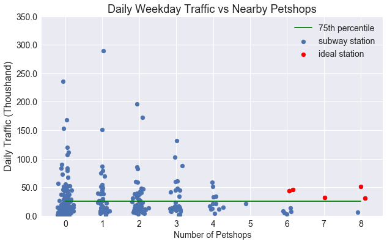
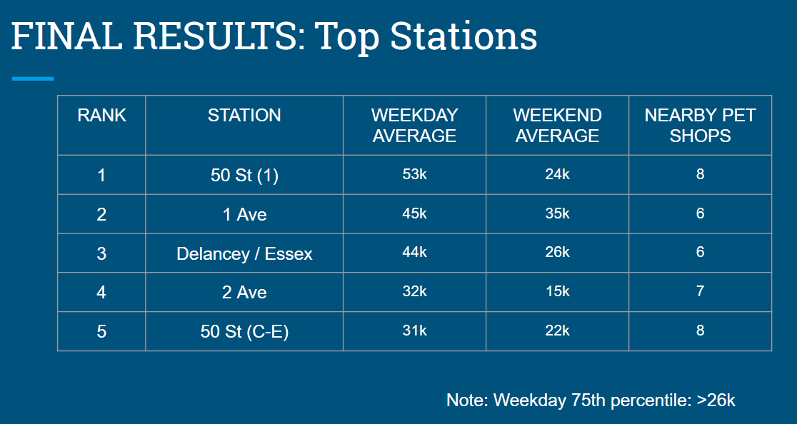

# Coffee Meets Cats
Using MTA turnstile data and pet store locations, we looked for locations that would be conducive to a new cat cafe.

# Data

We used three data sets for this projects.

1. MTA Turnstile data
2. MTA Station location data
3. NYC Business Inspections data

First, we extracted the estimated foot traffic at each station from the turnstile counters. Second, we matched stations to specific latitude and longitudes using the location data set. Third, we roughly filtered for pet related businesses from the inspections and extracted those addresses. 

With the latitudes and longitudes in hand for both the stations and the pet stores, we could use the Haversine formula to calculate the distance between them and count up how many pet stores are near each station. 

To make our recommendation, we found the five stations that have high amounts of both foot traffic and pet stores. 

 

Please check out the notebook for more details!

# Results

# Acknowledgements

My excellent collaborators for this project were [Nicholas Ondo](https://www.linkedin.com/in/nicholas-ondo-ph-d/) and [Ying Cai](https://www.linkedin.com/in/ycai/) from my Metis cohort.